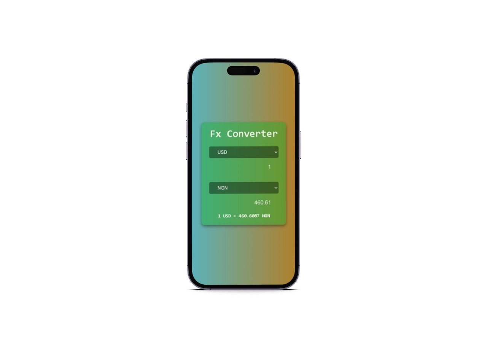

# Fx-Converter

This is a simple web application that allows users to convert currency values between different currencies. It uses an external API to fetch exchange rates and perform currency conversions.

# Getting Started
To use this application, simply download or clone the repository to your local machine and open the index.html file in a web browser.

bash
Copy code
git clone https://github.com/MalikOseni/Fx-Converter.git
cd Fx-Converter
open index.html

# How to Use
To use the fx-converter, follow these steps:

Select the currency you want to convert from in the first dropdown menu.
Enter the amount you want to convert in the input field.
Select the currency you want to convert to in the second dropdown menu.
The converted value will automatically update in the second input field.
API Reference
This application uses the ExchangeRate-API to fetch exchange rates and perform currency conversions. You will need to obtain an API key from the website to use this application.

# License
This project is licensed under the MIT License. See the LICENSE.md file for details.

Acknowledgements
This application was inspired by JavaScript 30 and uses Css for styling.

